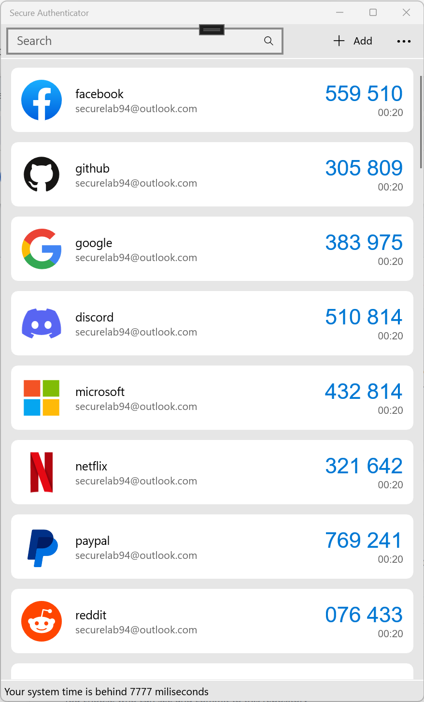
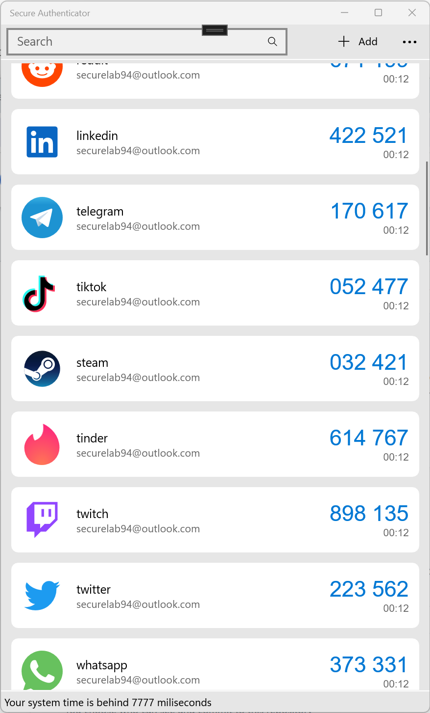
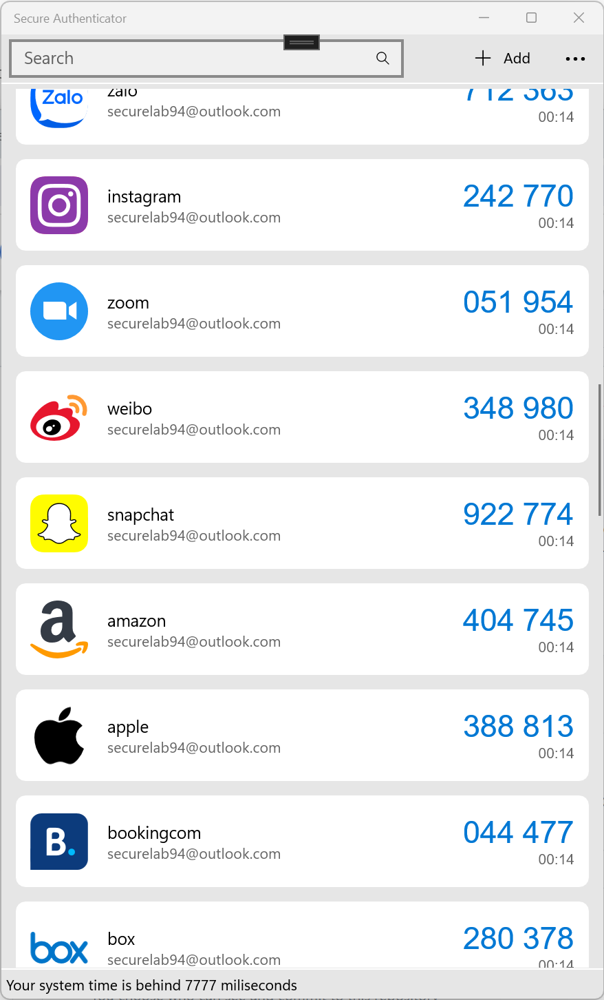
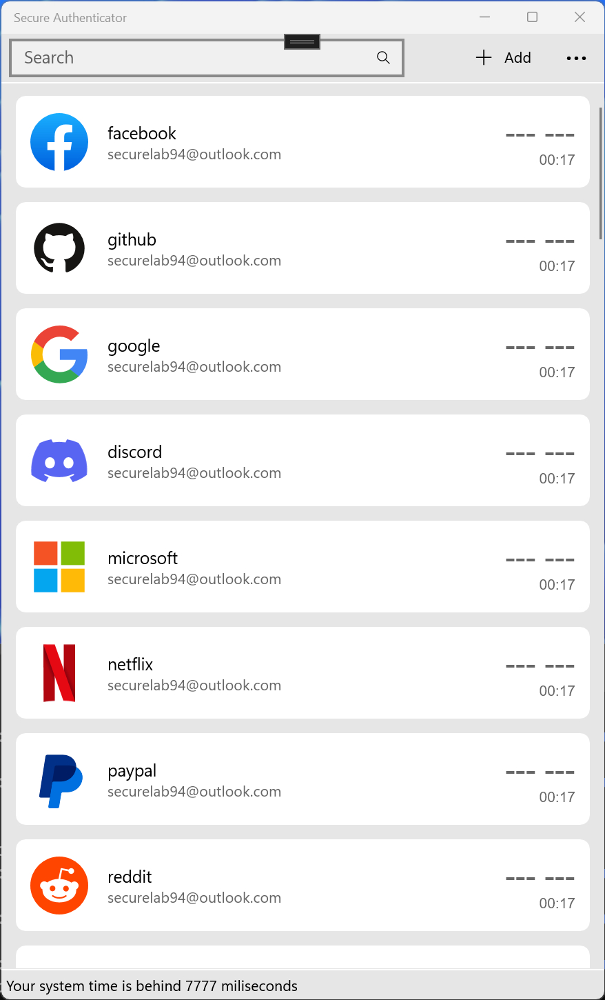
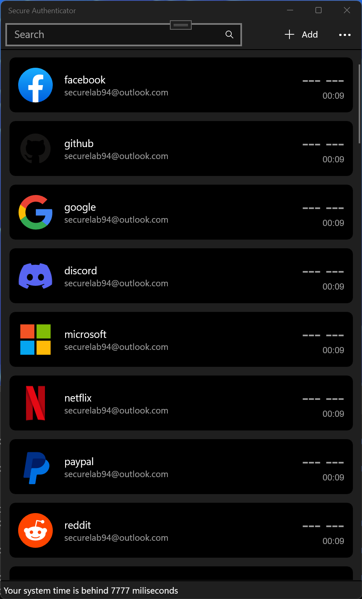

# SecureAuthenticator
Secure two factor authenticator in Windows is a simple and secure authentication app. It helps keep your online accounts secure by generating unique one-time passwords, which you use in combination with your other passwords to log into supporting websites. The simple combination of the password in your head and the rotating passwords generated by the app make it much harder for anyone but you to access your accounts.

## Features
Secure Authenticator supports many most well known browsers, includes Microsoft Edge, Google Chrome, Brave, etc.
  - TOTP for all famous websites such as facebook, google, twitter, twitch, etc
  - Support HOTP
  - Support MobileOtp
  - Support SteamOtp
  - Support YandexOtp
  - Single click to import and export
  - Support import from Google Authenticator
  - Support Scan from QR code and QR file

## Screenshot and Media

 
 
 
 
 

## Download and Installation
Secure Authenticator is available Microsft Store only at https://www.microsoft.com/store/apps/9P9W5SZ3CHB2

Open in Microsoft Store application at [Microsoft Store App](ms-windows-store://pdp/?productid=9P9W5SZ3CHB2)

## Privacy
The application Secure Authenticator (now called application) an application helps to generate two factor authentication code in Windows.

What Data We Collect and Process: The application Secure Authenticator does not collect, store or transit any personal personal data. 
The app does not use any own telemetry functions apart from the standardised telemetry functions by Microsoft (crashes, install from which country, versions in use, custom events etc.)